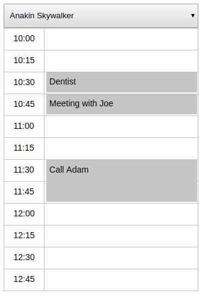

# Toxic Schedule component

Angular 6 module, rendering time slots for appointments.

Desktop layout             |  Mobile layout
:-------------------------:|:-------------------------:
  |  

## Install

```
npm install --save toxic-schedule
```

## Usage

1. Import **ToxicScheduleModule** in your project

```
import { BrowserModule } from "@angular/platform-browser";
import { NgModule } from "@angular/core";

import { AppComponent } from "./app.component";
import { ToxicScheduleModule } from "toxic-schedule";

@NgModule({
  declarations: [AppComponent],
  imports: [
    BrowserModule, 
    ToxicScheduleModule
  ],
  bootstrap: [AppComponent]
})
export class AppModule {}
```

2. Use the following HTML

```
<toxic-schedule 
    [interval]="15" 
    [startTime]="startTime" 
    [endTime]="endTime" 
    [reservedSlots]="reservedSlots"
    [sectors]="sectors"
    (slotSelected)="getSelectedTime($event)">
</toxic-schedule>
```

- **interval** - number, slot intervals in minutes
- **startTime** - Date object, representing the schedule start time
- **endTime** - Date object, representing the schedule end time
- **reservedSlots** - list of predefined time slots, which should be displayed in the schedule
- **sectors** - list of sector names (vertical columns). Must match the values from TimeSlot's *sector* property.
- **slotSelected** - event, which will be emittted when a slot is selected. TimeSlot model 
will be passed, eigther empty or one of the preselected.

## TimeSlot model

```
const timeSlot = new TimeSlot(startTime, endTime, sector, [description]);
```

- **startTime** - Slot start date/time. Date, string or milliseconds.
- **endTime** - Slot start date/time. Date, string or milliseconds.
- **sector** - Sector name, string.
- **description** - Optional, plain text description for this time slot. 

## Demo
1. Clone the project and install its dependencies
```
git clone https://github.com/vmanchev/toxic-schedule.git
cd toxic-schedule
npm install
```

2. Run the application
```
ng serve
```

3. Open your browser and navigate to `http://localhost:3000`

4. Play with it - change the data from src/app/app.component.ts file.

Screenshots can be found in the github repo.

## Features
- multiple sectors (e.g. all doctors in the clinic);
- customizable slot intervals;
- customizable start and end date/time;
- display reserved slots

## How it works
You'll get a nice schedule with sectors (columns) and time slots (rows). When the user 
clicks on any slot, *slotSelected* event will be dispatched. Use your own handler
function to capture the selected [TimeSlot](src/app/models/time-slot.model.ts) object.

The minimum required setup data would be:
- slots interval in minites
- at least one sector
- start date/time
- end date/time

In addition, you can provide a list of TimeSlot objects, which will be used as reserved 
slots. These will be displayed over the main grid of time slots, with different background, 
and the value from TimeSlot's *description* property will be displayed.


## Responsive layout
For small screens (below 576px in width), only one sector at a time will be displayed. All 
sectors are accessible via a dropdown. When the user selects a new sector, the related 
TimeSlot grid will be displayed along with the reserved slots, if any.

For bigger screens (576px and above), all sectors will be displayed. 


## Sample data
The following sample data was used to build the above screenshots:

```
    this.interval = 15;
    this.startTime = new Date('2018-09-20T10:00:00.000');
    this.endTime = new Date('2018-09-20T13:00:00.000');

    this.sectors = [
      'Anakin Skywalker',
      'Chewbacca',
      'Han Solo',
      'Leia Organa'
    ];

    this.reservedSlots = [
      new TimeSlot(
        '2018-09-20T10:30:00',
        '2018-09-20T10:44:59',
        'Anakin Skywalker',
        'Dentist',
        1
      ),
      new TimeSlot(
        '2018-09-20T10:45:00',
        '2018-09-20T10:59:59',
        'Anakin Skywalker',
        'Meeting with Joe',
        2
      ),
      new TimeSlot(
        '2018-09-20T11:30:00',
        '2018-09-20T11:59:59',
        'Anakin Skywalker',
        'Call Adam',
        3
      ),
      new TimeSlot(
        '2018-09-20T10:00:00',
        '2018-09-20T10:29:59',
        'Chewbacca',
        'Board meeting',
        4
      ),
      new TimeSlot(
        '2018-09-20T10:45:00',
        '2018-09-20T11:14:59',
        'Han Solo',
        'Dentist',
        5
      ),
      new TimeSlot(
        '2018-09-20T11:45:00',
        '2018-09-20T12:29:59',
        'Leia Organa',
        'Kinds/Lunch',
        6
      )
    ];
```

## Build the library
Run `ng build toxic-schedule` and find the output inside the `dist/toxic-schedule` folder.
